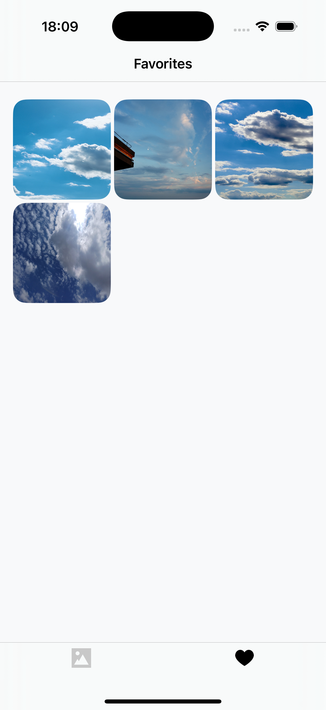

# UnsplashClient

iOS клиент для просмотра фотографий из Unsplash.

## Скриншоты

| Главный экран | Поиск фотографий | Детальный просмотр | Избранные фотографии |
|:-------------:|:----------------:|:-----------------:|:-------------------:|
| |  |  |  |

## Особенности

- **Просмотр фотографий**: Бесконечная лента фотографий с Unsplash
- **Поиск**: Быстрый поиск фотографий по ключевым словам
- **Детальный просмотр**: Полноэкранный просмотр фотографий
- **Избранное**: Сохранение понравившихся фотографий в локальное избранное
- **Темная тема**: Поддержка светлой и темной темы оформления
- **Современная архитектура**: Clean Architecture с использованием MVVM+Coordinator

## Архитектура

Приложение построено с использованием современных подходов:

- **MVVM + Coordinator**: Разделение логики представления и навигации
- **Dependency Injection**: Собственный DI-контейнер для управления зависимостями
- **Repository Pattern**: Абстракция работы с данными
- **Clean Architecture**: Четкое разделение слоев приложения
- **Design System**: Переиспользуемые UI компоненты

### Структура проекта

```
UnsplashClient/
├── Application/           # Точка входа приложения
├── Core/                 # Базовая функциональность
│   ├── DI/              # Dependency Injection
│   ├── Networking/      # Сетевой слой
│   ├── Repositories/    # Репозитории данных
│   └── Coordinator/     # Координаторы навигации
├── Features/            # Экраны приложения
│   ├── Home/           # Главный экран
│   ├── Search/         # Поиск фотографий
│   ├── PhotoDetail/    # Детальный просмотр
│   ├── Favorites/      # Избранные фотографии
│   ├── PhotoFeed/      # Лента фотографий
│   └── Splash/         # Экран загрузки
├── DesignSystem/       # UI компоненты и стили
│   ├── Components/     # Переиспользуемые компоненты
│   ├── Extensions/     # Расширения UIKit
│   └── Foundation/     # Цвета, шрифты, темы
└── Resources/          # Ресурсы приложения
```

## Установка и запуск

### 1. Клонирование репозитория

```bash
git clone https://github.com/yourusername/UnsplashClient.git
cd UnsplashClient
```

### 2. Настройка Unsplash API

⚠️ **Важно**: Для работы приложения необходим API ключ от Unsplash.

1. Зарегистрируйтесь на [Unsplash Developers](https://unsplash.com/developers)
2. Создайте новое приложение
3. Получите свой `Access Key`

### 3. Создание конфигурационного файла

Создайте файл Unsplash.xcconfig в директории UnsplashClient/Core/Networking/Unsplash/

Добавьте в файл `Unsplash.xcconfig` следующее содержимое:

```
BASE_URL = https:/$()/api.unsplash.com/
ACCESS_KEY = UNSPLASH_ACCESS_KEY
```

**Замените `UNSPLASH_ACCESS_KEY` на ваш реальный ключ от Unsplash API.**
